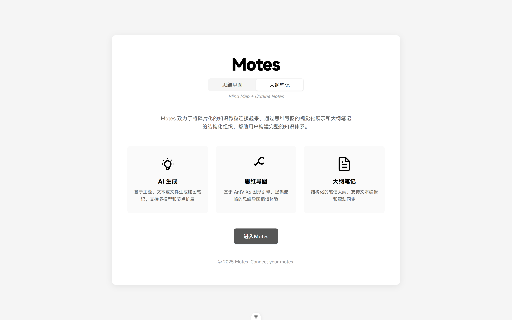
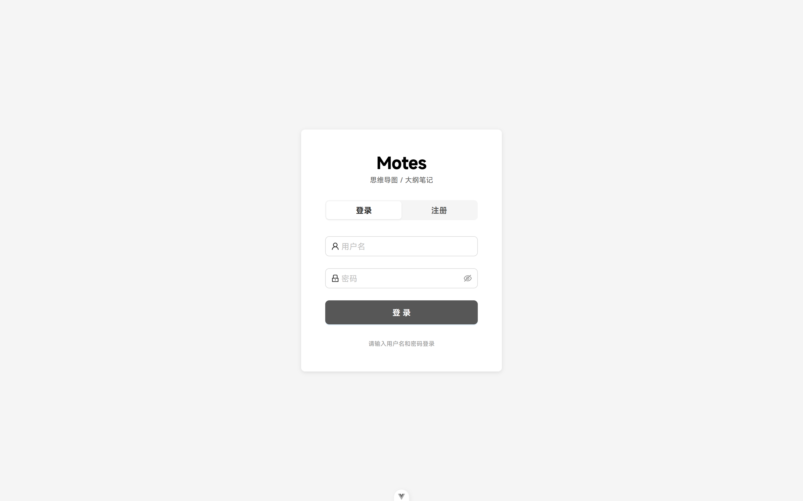
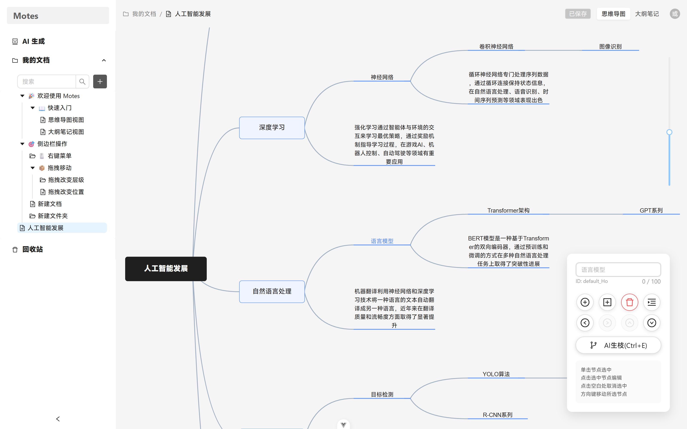
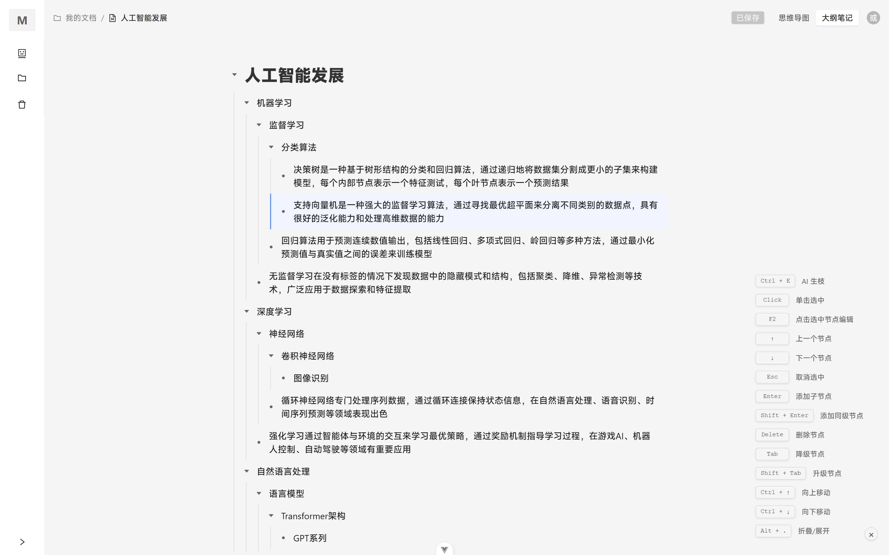
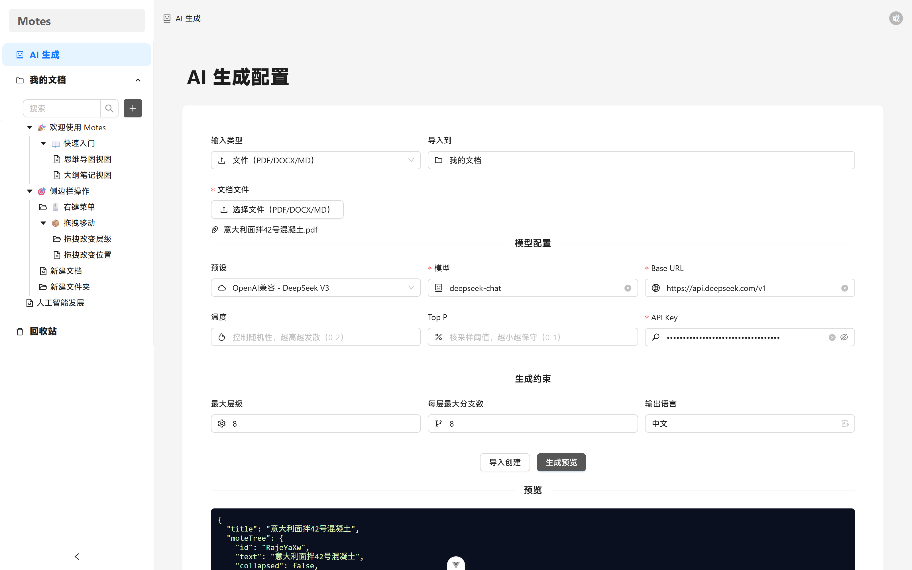
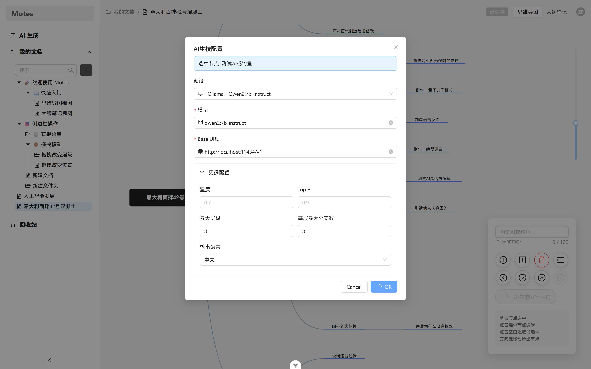
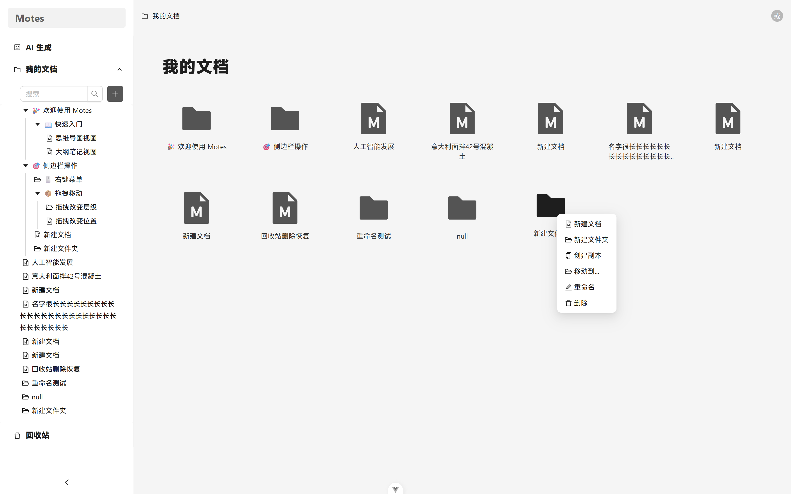
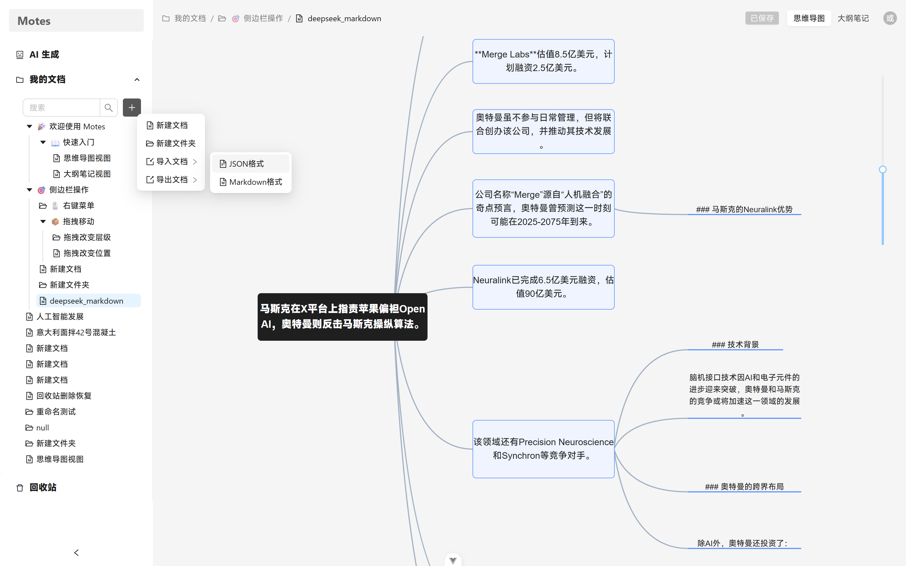
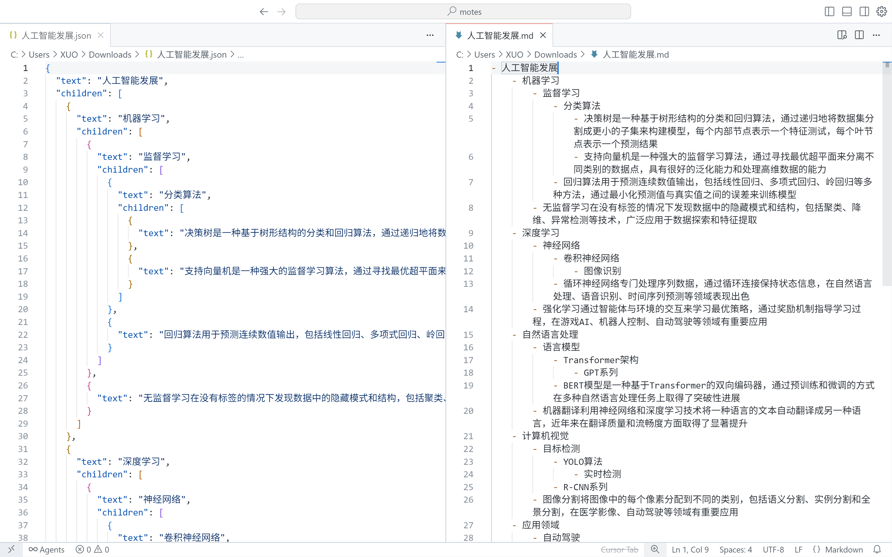

# Motes - 思维导图大纲笔记

## 📖 项目简介

Motes 是一个现代化的 AI 驱动的思维导图大纲笔记 Web 应用（基于 Vue 3 + Express.js），提供直观的思维导图编辑和便捷的大纲笔记操作功能，集成 OpenAI兼容、Ollama 等多种大语言模型服务，可基于主题、文本或文件自动生成结构化脑图笔记或基于已有脑图笔记进行节点拓展，帮助用户快速构建完整的知识网络。

### 项目命名

**Motes** = **M**ind **M**ap + Outline N**otes**

- **mote**：微粒的意思，是项目脑图笔记数据的基本存储单元
- **motes**：多个微粒的组合，强调多笔记关联、碎片化知识整合
- **核心理念**：一份数据两种视图（思维导图 + 大纲笔记）+ AI 智能生成
- **Slogan**："Connect your motes."（连接你的思维微粒）

### 设计理念

Motes 致力于将碎片化的知识微粒通过 AI 智能技术连接起来，通过思维导图的视觉化展示和大纲笔记的结构化组织，结合大语言模型的智能生成能力，帮助用户快速构建完整的知识体系。每个 mote（微粒）都是知识的最小单元，通过 AI 的智能分析和连接，形成强大的知识网络。

## 运行截图


<p align="center"><small>项目主页</small></p>


<p align="center"><small>登录注册页</small></p>


<p align="center"><small>思维导图视图</small></p>


<p align="center"><small>大纲笔记视图</small></p>


<p align="center"><small>AI生成视图</small></p>


<p align="center"><small>AI生枝视图</small></p>


<p align="center"><small>文档管理视图</small></p>


<p align="center"><small>文档导入</small></p>


<p align="center"><small>文档导出</small></p>

## ✨ 主要功能

### 🤖 AI 智能功能
- **AI 生成脑图笔记**：基于主题、文本或文件自动生成结构化脑图笔记
- **AI 节点扩展**：选中节点后使用 AI 自动扩展子节点（AI生枝）
- **多模型支持**：集成 OpenAI兼容、Ollama 等多种大语言模型服务
- **预设配置**：内置常用模型预设，快速配置
- **文件解析**：支持 PDF、DOCX、Markdown 文件解析生成
- **实时预览**：生成成功可预览结果，确认后导入
- **代理配置**：支持 HTTP 代理配置，适应不同网络环境

### 🧠 思维导图
- **直观的节点连接**：基于 AntV X6 图形引擎，提供流畅的思维导图编辑体验
- **灵活的节点操作**：支持节点的添加、删除、编辑等操作
- **键盘快捷键**：丰富的快捷键支持，提升编辑效率
- **节点选择**：支持单选交互操作
- **自动布局**：智能的层次布局算法，自动排列节点位置
- **缩放控制**：支持图形缩放和平移操作

### 📝 大纲笔记
- **大纲视图**：结构化的笔记大纲，清晰展示内容层次
- **文本编辑**：支持节点文本的实时编辑和修改
- **实时同步**：与思维导图实时同步，数据一致性保证
- **滚动同步**：大纲与思维导图视图间的滚动位置同步
- **折叠展开**：支持节点的折叠和展开操作

### 🔐 用户系统
- **JWT 认证**：基于 JSON Web Token 的用户身份验证
- **用户注册登录**：完整的用户注册和登录流程
- **数据隔离**：用户数据安全隔离，隐私保护
- **云端同步**：数据安全存储，支持多设备访问

### 📄 文档管理
- **文档 CRUD**：完整的文档创建、读取、更新、删除操作
- **用户权限控制**：基于用户身份的数据访问控制
- **文档元数据**：支持文档标题、描述、创建时间等元信息管理

### 💾 数据管理
- **自动保存**：支持文档的自动保存功能
- **导入导出**：支持文档的导入导出功能
- **版本控制**：文档修改状态跟踪

### 🛡️ 安全特性
- **密码加密**：使用 bcryptjs 进行密码安全加密
- **CORS 配置**：跨域资源共享的安全配置
- **请求限流**：API 请求频率限制保护
- **输入验证**：严格的数据输入验证和清理

## 🛠 技术栈

### 前端技术栈
- **Vue 3.5.17** - 渐进式 JavaScript 框架
- **TypeScript ~5.8.0** - 类型安全的 JavaScript 超集
- **Vite ^7.0.0** - 下一代前端构建工具
- **Ant Design Vue 4.2.6** - 企业级 UI 设计语言
- **@antv/x6 2.18.1** - 图编辑引擎
- **Pinia 3.0.3** - Vue 的状态管理库
- **Vue Router 4.5.1** - Vue.js 官方路由管理器

### 后端技术栈
- **Node.js 18+** - JavaScript 运行时环境
- **Express.js 4.18.2** - 快速、灵活的 Node.js Web 应用框架
- **TypeScript 5.3.3** - 类型安全的 JavaScript 超集
- **MongoDB 8.0.3** - 文档型 NoSQL 数据库
- **Mongoose 8.0.3** - MongoDB 对象建模工具
- **JWT 9.0.2** - JSON Web Token 实现
- **bcryptjs 2.4.3** - 密码哈希加密

### AI 与文档处理
- **axios 1.11.0** - HTTP 客户端，用于 LLM API 调用
- **https-proxy-agent 7.0.6** - HTTP 代理支持
- **mammoth 1.6.0** - Word 文档解析
- **pdf-parse 1.1.1** - PDF 文档解析
- **compromise 14.14.4** - 自然语言处理工具
- **multer 1.4.5-lts.1** - 文件上传中间件

### 开发工具
- **ESLint** - 代码质量检查
- **Prettier** - 代码格式化
- **Less** - CSS 预处理器

## 🚀 快速开始

### 环境要求
- Node.js >= 18.0.0
- MongoDB >= 5.0.0
- npm >= 8.0.0

### 1. 克隆项目
```bash
git clone https://github.com/LiuXuo/Motes
cd motes
```

### 2. 后端设置

#### 安装依赖
```bash
cd motes-backend
npm install
```

#### 环境配置
```bash
# 复制环境变量文件
cp env.example .env

# 配置环境变量
MONGODB_URI=mongodb://localhost:27017/motes
JWT_SECRET=your-secret-key-change-in-production
JWT_EXPIRES_IN=7d
PORT=3000
NODE_ENV=development
CORS_ORIGIN=http://localhost:5173

# AI 服务配置（可选）
# OpenAI API 配置
OPENAI_API_KEY=your-openai-api-key
OPENAI_BASE_URL=https://api.openai.com/v1

# Ollama 配置
OLLAMA_BASE_URL=http://localhost:11434

# 代理配置（可选）
HTTP_PROXY=http://proxy-server:port
HTTPS_PROXY=http://proxy-server:port
```

#### 启动后端服务
```bash
# 开发模式
npm run dev

# 或构建并启动生产版本
npm run build
npm start
```

后端服务将在 `http://localhost:3000` 启动

### 3. 前端设置

#### 安装依赖
```bash
cd motes-frontend
npm install
```

#### 启动前端应用
```bash
# 开发模式
npm run dev
```

前端应用将在 `http://localhost:5173` 启动

### 4. 访问应用
打开浏览器访问 `http://localhost:5173` 即可使用 Motes 应用。

## 🤖 AI 功能详解

### AI 生成脑图笔记
支持三种输入方式生成脑图笔记：

1. **主题生成**：输入一个主题，AI 自动生成相关的脑图笔记结构
2. **文本生成**：粘贴或输入文本内容，AI 解析并生成结构化脑图笔记
3. **文件生成**：上传 PDF、DOCX 或 Markdown 文件，AI 解析文件内容生成脑图笔记

### AI 节点扩展
在脑图笔记编辑过程中，选中任意节点后：
- 点击节点操作按钮中的"AI生枝"
- 或使用快捷键 `Ctrl+E`
- 配置 AI 模型参数
- AI 自动为选中节点生成相关的子节点

### 预设的 AI 模型

#### Ollama 本地模型
- **Qwen2:7b-instruct** - 通义千问2 7B 指令模型
- **Llama3.1:8b-instruct** - Meta Llama3.1 8B 指令模型
- **Mistral:7b-instruct** - Mistral 7B 指令模型
- **Gemma3:4b** - Google Gemma3 4B 模型

#### OpenAI 兼容模型
- **GPT-4o-mini** - OpenAI GPT-4o 迷你版
- **GPT-3.5-turbo** - OpenAI GPT-3.5 Turbo
- **DeepSeek V3** - DeepSeek Chat 模型
- **DeepSeek R1** - DeepSeek Reasoner 模型
- **Gemini 2.0 Flash** - Google Gemini 2.0 Flash 模型
- **Gemini 2.0 Flash Exp** - Google Gemini 2.0 Flash Exp 模型
- **Gemini 1.5 Flash** - Google Gemini 1.5 Flash 模型

#### 手动配置
除了预设模型外，还支持手动配置任何 OpenAI 兼容的 API 服务，包括：
- 自定义本地模型
- 第三方 AI 服务提供商
- 私有部署的模型服务

### AI 配置参数
- **温度 (Temperature)**：控制生成随机性，0-2 范围
- **Top P**：控制生成多样性，0-1 范围
- **最大 Token 数**：限制生成内容长度
- **深度限制**：控制脑图笔记层级深度
- **分支因子**：控制每个节点的子节点数量
- **语言偏好**：支持中文和英文生成

## 🔗 相关链接

- [本项目前端文档](./motes-frontend/README.md)
- [本项目后端文档](./motes-backend/README.md)
- [本项目 API 文档](./API_DOCUMENTATION.md)
- [Vue.js 文档](https://vuejs.org/)
- [Express.js 文档](https://expressjs.com/)
- [AntV X6 文档](https://x6.antv.antgroup.com/)
- [OpenAI API 文档](https://platform.openai.com/docs)
- [Gemini API 文档](https://ai.google.dev/gemini-api/docs/openai)
- [Deepseek API 文档](https://api-docs.deepseek.com/)
- [Ollama 文档](https://ollama.ai/docs)

**Motes** - Connect your motes. 
