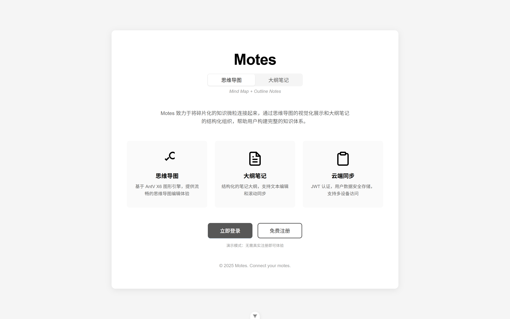
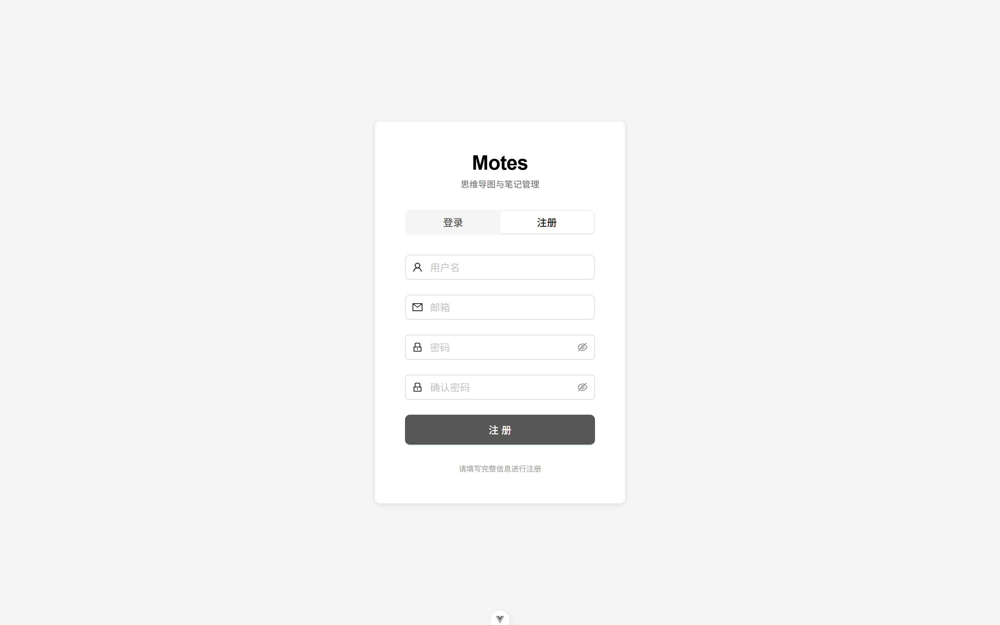
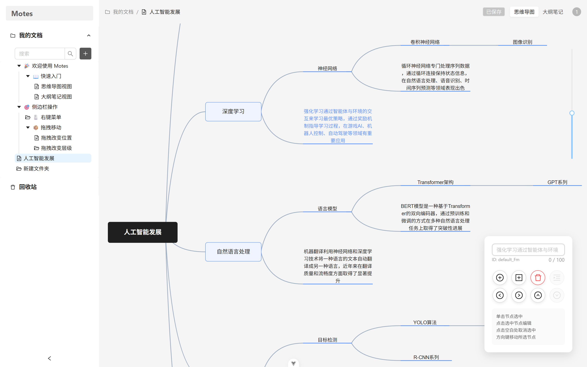
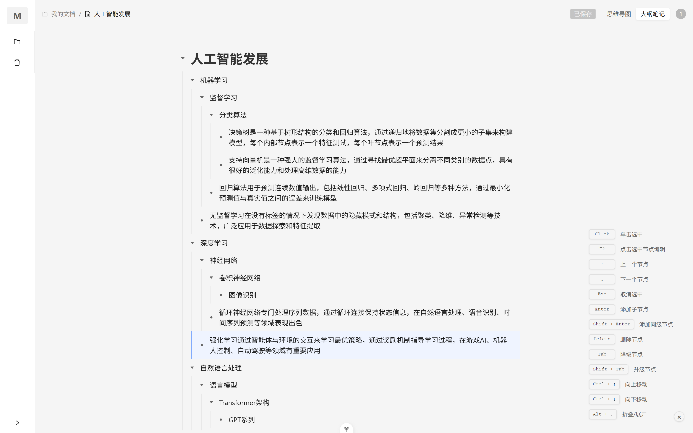
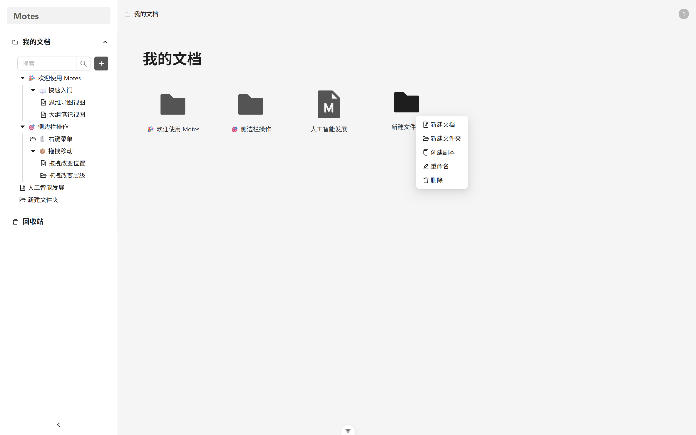
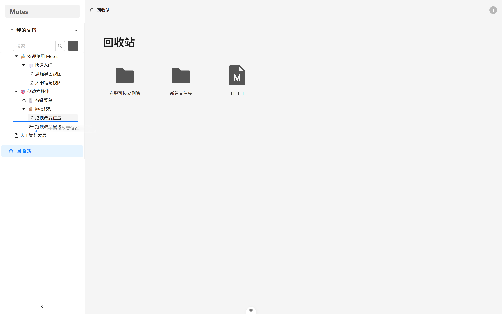
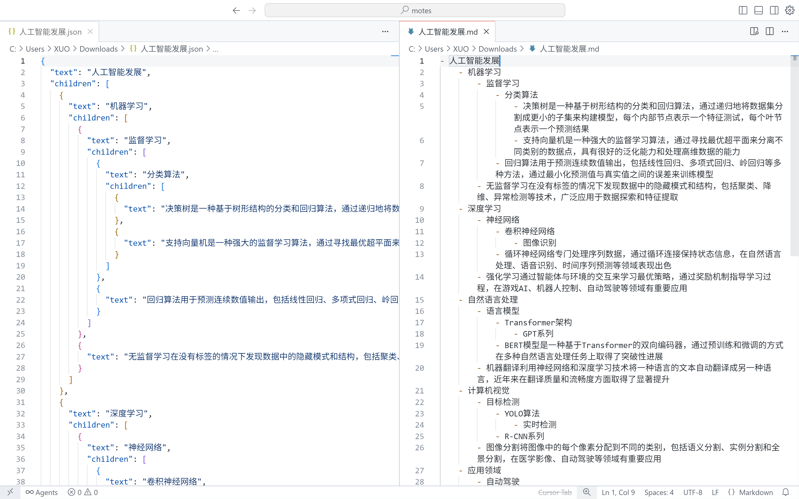

# Motes - 思维导图大纲笔记

## 📖 项目简介

Motes 是一个现代化的思维导图与大纲笔记应用，采用前后端分离架构（Vue 3 + Express.js），提供直观的思维导图编辑和强大的笔记管理功能，帮助用户构建完整的知识网络。

### 项目命名

**Motes** = **M**ind **M**ap + Outline N**otes**

- **mote**：微粒的意思，是项目脑图笔记数据的基本存储单元
- **motes**：多个微粒的组合，强调多笔记关联、碎片化知识整合
- **核心理念**：一份数据两种视图（思维导图 + 大纲笔记）
- **Slogan**："Connect your motes."（连接你的思维微粒）

### 设计理念

Motes 致力于将碎片化的知识微粒连接起来，通过思维导图的视觉化展示和大纲笔记的结构化组织，帮助用户构建完整的知识体系。每个 mote（微粒）都是知识的最小单元，通过连接和组合，形成强大的知识网络。

## 运行截图


<center><small>项目主页</small></center>


<center><small>登录注册页</small></center>


<center><small>思维导图视图</small></center>


<center><small>大纲笔记视图</small></center>


<center><small>文档管理视图</small></center>


<center><small>回收站视图</small></center>


<center><small>文档导入</small></center>


<center><small>文档导出</small></center>

## ✨ 主要功能

### 🧠 思维导图
- **直观的节点连接**：基于 AntV X6 图形引擎，提供流畅的思维导图编辑体验
- **灵活的节点操作**：支持节点的添加、删除、编辑等操作
- **键盘快捷键**：丰富的快捷键支持，提升编辑效率
- **自动布局**：智能的层次布局算法，自动排列节点位置
- **缩放控制**：支持图形缩放和平移操作

### 📝 大纲笔记
- **大纲视图**：结构化的笔记大纲，清晰展示内容层次
- **文本编辑**：支持节点文本的实时编辑和修改
- **实时同步**：与思维导图实时同步，数据一致性保证
- **滚动同步**：大纲与思维导图视图间的滚动位置同步

### 🔐 用户系统
- **JWT 认证**：基于 JSON Web Token 的用户身份验证
- **用户注册登录**：完整的用户注册和登录流程
- **数据隔离**：用户数据安全隔离，隐私保护
- **云端同步**：数据安全存储，支持多设备访问

### 📄 文档管理
- **文档 CRUD**：完整的文档创建、读取、更新、删除操作
- **用户权限控制**：基于用户身份的数据访问控制
- **文档元数据**：支持文档标题、描述、创建时间等元信息管理

### 💾 数据管理
- **自动保存**：支持文档的自动保存功能
- **导入导出**：支持文档的导入导出功能
- **版本控制**：文档修改状态跟踪

### 🛡️ 安全特性
- **密码加密**：使用 bcryptjs 进行密码安全加密
- **CORS 配置**：跨域资源共享的安全配置
- **请求限流**：API 请求频率限制保护
- **输入验证**：严格的数据输入验证和清理

## 🛠 技术栈

### 前端技术栈
- **Vue 3.5.17** - 渐进式 JavaScript 框架
- **TypeScript ~5.8.0** - 类型安全的 JavaScript 超集
- **Vite ^7.0.0** - 下一代前端构建工具
- **Ant Design Vue 4.2.6** - 企业级 UI 设计语言
- **@antv/x6 2.18.1** - 图编辑引擎
- **Pinia 3.0.3** - Vue 的状态管理库
- **Vue Router 4.5.1** - Vue.js 官方路由管理器

### 后端技术栈
- **Node.js 18+** - JavaScript 运行时环境
- **Express.js 4.18.2** - 快速、灵活的 Node.js Web 应用框架
- **TypeScript 5.3.3** - 类型安全的 JavaScript 超集
- **MongoDB 8.0.3** - 文档型 NoSQL 数据库
- **Mongoose 8.0.3** - MongoDB 对象建模工具
- **JWT 9.0.2** - JSON Web Token 实现
- **bcryptjs 2.4.3** - 密码哈希加密

### 开发工具
- **ESLint** - 代码质量检查
- **Prettier** - 代码格式化
- **Less** - CSS 预处理器

## 🚀 快速开始

### 环境要求
- Node.js >= 18.0.0
- MongoDB >= 5.0.0
- npm >= 8.0.0

### 1. 克隆项目
```bash
git clone <repository-url>
cd motes
```

### 2. 后端设置

#### 安装依赖
```bash
cd motes-backend
npm install
```

#### 环境配置
```bash
# 复制环境变量文件
cp env.example .env

# 配置环境变量
MONGODB_URI=mongodb://localhost:27017/motes
JWT_SECRET=your-secret-key-change-in-production
JWT_EXPIRES_IN=7d
PORT=3000
NODE_ENV=development
CORS_ORIGIN=http://localhost:5173
```

#### 启动后端服务
```bash
# 开发模式
npm run dev

# 或构建并启动生产版本
npm run build
npm start
```

后端服务将在 `http://localhost:3000` 启动

### 3. 前端设置

#### 安装依赖
```bash
cd motes-frontend
npm install
```

#### 启动前端应用
```bash
# 开发模式
npm run dev
```

前端应用将在 `http://localhost:5173` 启动

### 4. 访问应用
打开浏览器访问 `http://localhost:5173` 即可使用 Motes 应用。

## 🔗 相关链接

- [前端文档](./motes-frontend/README.md)
- [后端文档](./motes-backend/README.md)
- [API 文档](./API_DOCUMENTATION.md)
- [Vue.js 文档](https://vuejs.org/)
- [Express.js 文档](https://expressjs.com/)
- [AntV X6 文档](https://x6.antv.antgroup.com/)

## 📄 许可证

本项目采用 MIT 许可证。

## 🤝 贡献指南

欢迎提交 Issue 和 Pull Request 来帮助改进项目。

### 贡献流程
1. Fork 本项目
2. 创建特性分支 (`git checkout -b feature/AmazingFeature`)
3. 提交更改 (`git commit -m 'Add some AmazingFeature'`)
4. 推送到分支 (`git push origin feature/AmazingFeature`)
5. 打开 Pull Request

### 代码规范
- 遵循 ESLint 配置的代码规范
- 使用 TypeScript 进行类型安全开发
- 编写清晰的注释和文档

---

**Motes** - Connect your motes. 