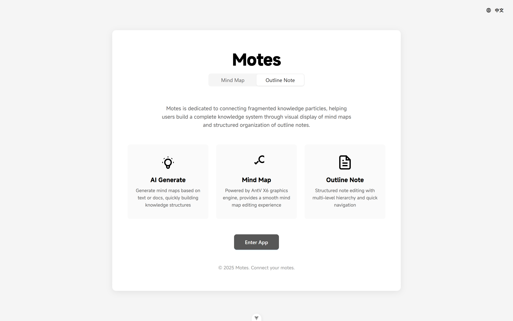
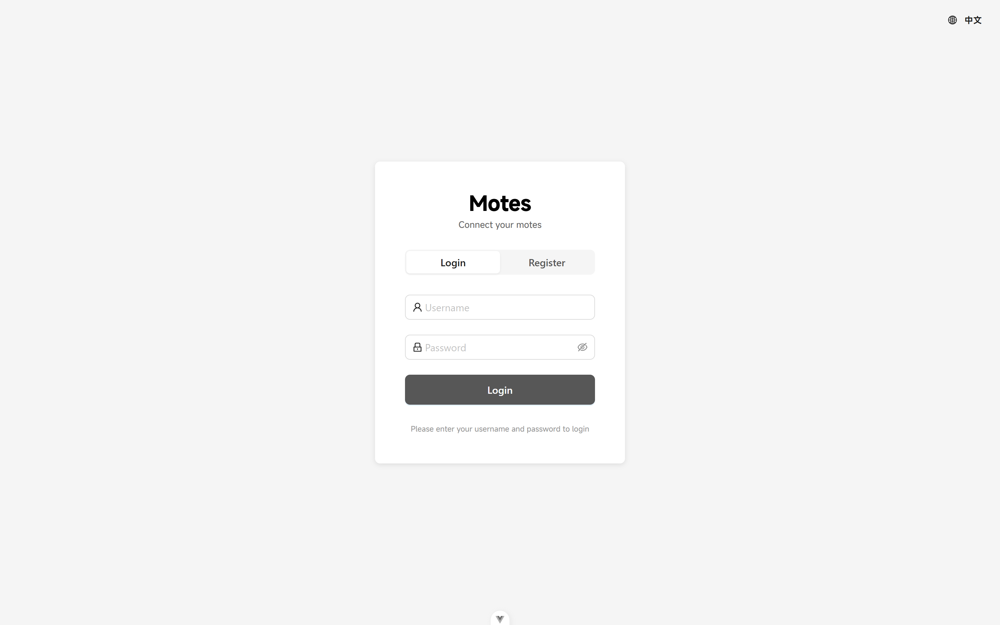
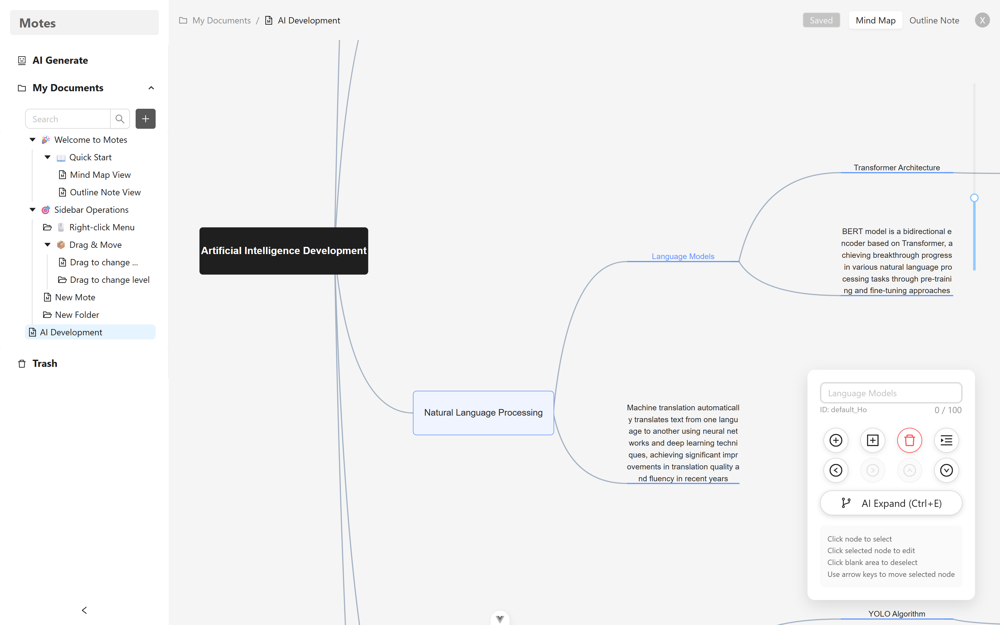
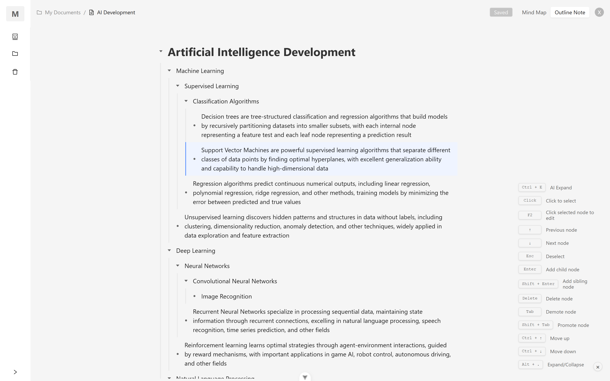
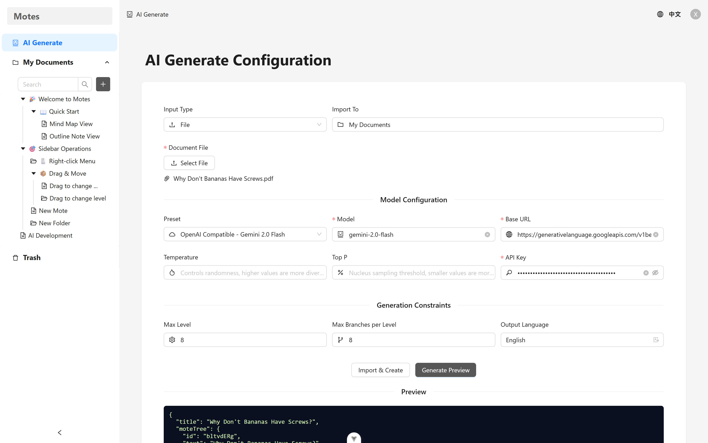
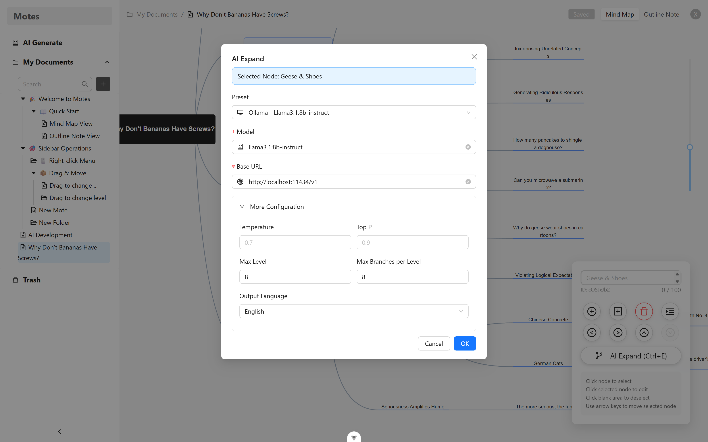
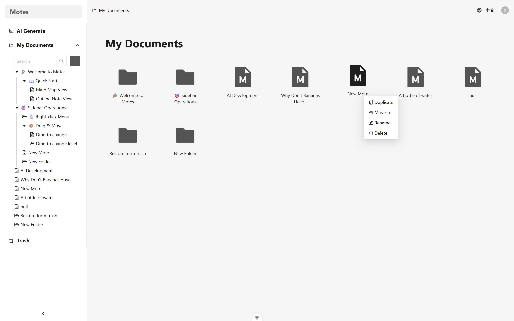
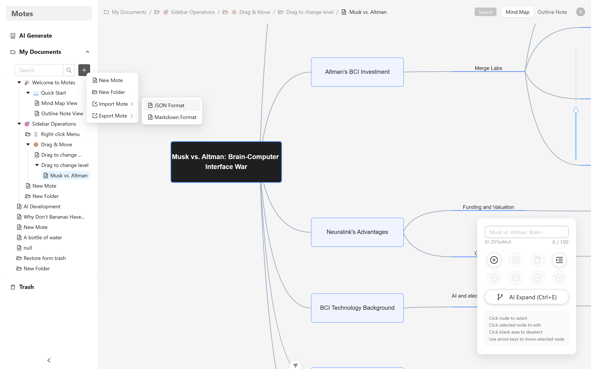
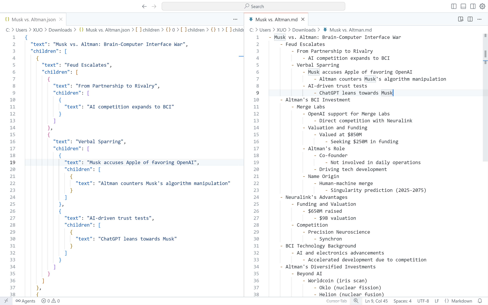

# Motes - Mind Map Outline Notes

<p align="center">
  <a href="./motes-frontend/README_en.md">
    
  </a>
  <a href="./motes-backend/README_en.md">
    
  </a>
  <a href="./API_DOCUMENTATION_en.md">
    
  <br />
  <a href="./README.md">
    
  </a>
  </a>
</p>

## 📖 Introduction

Motes is a modern AI-powered mind map outline notes web application (based on Vue.js + Express.js), providing intuitive mind map editing and convenient outline notes operations. It integrates multiple LLM services such as OpenAI-compatible APIs and Ollama, allowing automatic generation of structured mind map notes based on themes, text, or files, or extension of nodes based on existing mind map notes, helping users quickly build complete knowledge networks.

### Project Naming

**Motes** = **M**ind **M**ap + Outline N**otes**

- **mote**: Meaning "particle," it is the basic storage unit for project mind map note data.
- **motes**: A combination of multiple particles, emphasizing the association of multiple notes and integration of fragmented knowledge.
- **Core Concept**: One data set with two views (mind map + outline note) + AI generation.
- **Slogan**: "Connect your motes."

### Design Philosophy

Motes is committed to connecting fragmented knowledge particles through AI technology. Through visual display of mind maps and structured organization of outline notes, combined with the intelligent generation capabilities of LLM, it helps users quickly build complete knowledge systems. Each mote (particle) is the smallest unit of knowledge, forming a powerful knowledge network through AI's analysis and connection.

## Screenshots


<p align="center"><small>Project Homepage</small></p>


<p align="center"><small>Login & Register Page</small></p>


<p align="center"><small>Mind Map View</small></p>


<p align="center"><small>Outline Note View</small></p>


<p align="center"><small>AI Generation View</small></p>


<p align="center"><small>AI Expand View</small></p>


<p align="center"><small>Document Management View</small></p>


<p align="center"><small>Document Import</small></p>


<p align="center"><small>Document Export</small></p>

## ✨ Main Features

### 🤖 AI Features
- **AI Generate Mote**: Automatically generate structured mote based on themes, text, or files.
- **AI Expand Node**: After selecting a node, use AI to automatically extend child nodes.
- **Multi-Model Support**: Integrates multiple LLM services compatible with OpenAI and Ollama.
- **Preset Configurations**: Built-in presets for common models for quick setup.
- **File Parsing**: Supports parsing of PDF, DOCX, and Markdown files for generation.
- **Real-Time Preview**: Preview results after generation and import after confirmation.
- **Proxy Configuration**: Supports HTTP proxy configuration to adapt to different network environments.

### 🧠 Mind Map
- **Intuitive Node Connections**: Based on AntV X6 graphics engine, providing a smooth mind map editing experience.
- **Flexible Node Operations**: Supports adding, deleting, editing nodes, etc.
- **Keyboard Shortcuts**: Rich shortcut key support to improve editing efficiency.
- **Node Selection**: Supports single selection interactive operations.
- **Automatic Layout**: Intelligent hierarchical layout algorithm to automatically arrange node positions.
- **Zoom Control**: Supports graph zooming and panning operations.

### 📝 Outline Notes
- **Outline View**: Structured note outline, clearly displaying content hierarchy.
- **Text Editing**: Supports real-time editing and modification of node text.
- **Real-Time Synchronization**: Synchronizes in real-time with the mind map, ensuring data consistency.
- **Scroll Synchronization**: Synchronizes scroll positions between outline and mind map views.
- **Collapse and Expand**: Supports node collapse and expand operations.

### 🔐 User System
- **JWT Authentication**: User identity verification based on JSON Web Token.
- **User Registration and Login**: Complete user registration and login process.
- **Data Isolation**: Secure isolation of user data, privacy protection.
- **Cloud Synchronization**: Secure data storage, supporting multi-device access.

### 📄 Document Management
- **Document CRUD**: Complete create, read, update, delete operations for documents.
- **User Permission Control**: Data access control based on user identity.
- **Document Metadata**: Supports management of document title, description, creation time, etc.

### 💾 Data Management
- **Automatic Save**: Supports automatic saving of documents.
- **Import and Export**: Supports document import and export functions.
- **Version Control**: Tracks document modification status.

### 🛡️ Security Features
- **Password Encryption**: Uses bcryptjs for secure password encryption.
- **CORS Configuration**: Secure configuration for cross-origin resource sharing.
- **Request Rate Limiting**: API request frequency limit protection.
- **Input Validation**: Strict data input validation and sanitization.

## 🛠 Technology Stack

### Frontend Technology Stack
- **Vue 3.5.17** - Progressive JavaScript framework.
- **TypeScript ~5.8.0** - Typed superset of JavaScript.
- **Vite ^7.0.0** - Next-generation frontend build tool.
- **Ant Design Vue 4.2.6** - Enterprise-level UI design language.
- **@antv/x6 2.18.1** - Graph editing engine.
- **Pinia 3.0.3** - Vue state management library.
- **Vue Router 4.5.1** - Official router for Vue.js.
- **Vue I18n 9.14.5** - Internationalization plugin for Vue.js.

### Backend Technology Stack
- **Node.js 18+** - JavaScript runtime environment.
- **Express.js 4.18.2** - Fast, flexible Node.js web application framework.
- **TypeScript 5.3.3** - Typed superset of JavaScript.
- **MongoDB 8.0.3** - Document-oriented NoSQL database.
- **Mongoose 8.0.3** - MongoDB object modeling tool.
- **JWT 9.0.2** - JSON Web Token implementation.
- **bcryptjs 2.4.3** - Password hashing encryption.

### AI and Document Processing
- **axios 1.11.0** - HTTP client for LLM API calls.
- **https-proxy-agent 7.0.6** - HTTP proxy support.
- **mammoth 1.6.0** - Word document parsing.
- **pdf-parse 1.1.1** - PDF document parsing.
- **compromise 14.14.4** - Natural language processing tool.
- **multer 1.4.5-lts.1** - File upload middleware.

### Development Tools
- **ESLint** - Code quality checker.
- **Prettier** - Code formatter.
- **Less** - CSS preprocessor.

## 🚀 Quick Start

### Environment Requirements
- Node.js >= 18.0.0
- MongoDB >= 5.0.0
- npm >= 8.0.0

### 1. Clone the Project
```bash
git clone https://github.com/LiuXuo/Motes
cd motes
```

### 2. Backend Setup

#### Install Dependencies
```bash
cd motes-backend
npm install
```

#### Environment Configuration
```bash
# Copy environment variable file
cp env.example .env

# Configure environment variables
MONGODB_URI=mongodb://localhost:27017/motes
JWT_SECRET=your-secret-key-change-in-production
JWT_EXPIRES_IN=7d
PORT=3000
NODE_ENV=development
CORS_ORIGIN=http://localhost:5173

# AI Service Configuration (Optional)
# OpenAI API Configuration
OPENAI_API_KEY=your-openai-api-key
OPENAI_BASE_URL=https://api.openai.com/v1

# Ollama Configuration
OLLAMA_BASE_URL=http://localhost:11434

# Proxy Configuration (Optional)
HTTP_PROXY=http://proxy-server:port
HTTPS_PROXY=http://proxy-server:port
```

#### Start Backend Service
```bash
# Development mode
npm run dev

# Or build and start production version
npm run build
npm start
```

The backend service will start at `http://localhost:3000`.

### 3. Frontend Setup

#### Install Dependencies
```bash
cd motes-frontend
npm install
```

#### Start Frontend Application
```bash
# Development mode
npm run dev
```

The frontend application will start at `http://localhost:5173`.

### 4. Access the Application
Open your browser and visit `http://localhost:5173` to use the Motes application.

## 🤖 AI Features in Detail

### AI Generate Mind Map Notes
Supports three input methods to generate mind map notes:

1. **Theme Generation**: Input a theme, and AI automatically generates related mind map note structures.
2. **Text Generation**: Paste or input text content, and AI parses and generates structured mind map notes.
3. **File Generation**: Upload PDF, DOCX, or Markdown files, and AI parses the file content to generate mind map notes.

### AI Node Extension
During mind map note editing, after selecting any node:
- Click the "AI Branch" in the node operation buttons.
- Or use the shortcut key `Ctrl+E`.
- Configure AI model parameters.
- AI automatically generates related child nodes for the selected node.

### Preset AI Models

#### Ollama Local Models
- **Qwen2:7b-instruct** - Tongyi Qianwen 2 7B instruction model.
- **Llama3.1:8b-instruct** - Meta Llama3.1 8B instruction model.
- **Mistral:7b-instruct** - Mistral 7B instruction model.
- **Gemma3:4b** - Google Gemma3 4B model.

#### OpenAI Compatible Models
- **GPT-4o-mini** - OpenAI GPT-4o mini version.
- **GPT-3.5-turbo** - OpenAI GPT-3.5 Turbo.
- **DeepSeek V3** - DeepSeek Chat model.
- **DeepSeek R1** - DeepSeek Reasoner model.
- **Gemini 2.0 Flash** - Google Gemini 2.0 Flash model.
- **Gemini 2.0 Flash Exp** - Google Gemini 2.0 Flash Exp model.
- **Gemini 1.5 Flash** - Google Gemini 1.5 Flash model.

#### Manual Configuration
In addition to preset models, it also supports manual configuration of any OpenAI-compatible API services, including:
- Custom local models.
- Third-party AI service providers.
- Privately deployed model services.

### AI Configuration Parameters
- **Temperature**: Controls generation randomness, range 0-2.
- **Top P**: Controls generation diversity, range 0-1.
- **Max Tokens**: Limits the length of generated content.
- **Depth Limit**: Controls the hierarchical depth of mind map notes.
- **Branch Factor**: Controls the number of child nodes per node.
- **Language Preference**: Supports generation in Chinese and English.

## 🔗 Related Links

- [Vue.js Documentation](https://vuejs.org/)
- [Express.js Documentation](https://expressjs.com/)
- [AntV X6 Documentation](https://x6.antv.antgroup.com/)
- [OpenAI API Documentation](https://platform.openai.com/docs)
- [Gemini API Documentation](https://ai.google.dev/gemini-api/docs/openai)
- [Deepseek API Documentation](https://api-docs.deepseek.com/)
- [Ollama Documentation](https://ollama.ai/docs)

**Motes** - Connect your motes.